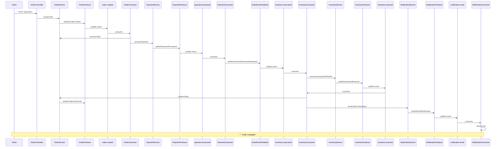

# 🏗️ Architecture Documentation

System design and architecture for the Kafka-based E-Commerce Order Processing System.

**Last Updated:** March 2026

---

## Table of Contents

1. [System Overview](#system-overview)
2. [Architecture Diagram](#architecture-diagram)
3. [Data Flow](#data-flow)
4. [Service Architecture](#service-architecture)
5. [Event Flow](#event-flow)
6. [Deployment Architecture](#deployment-architecture)
7. [Configuration](#configuration)

---

## System Overview

### E-Commerce Order Processing System

This project implements an **event-driven e-commerce platform** using Apache Kafka and Spring Boot 3.2.

**Core Business Process:**
```
Customer places order → Payment processed → Inventory reserved → Notification sent → Order shipped
```

### Technology Stack

| Technology | Version | Purpose |
|------------|---------|---------|
| Java | 21 | Programming language |
| Spring Boot | 3.2.3 | Application framework |
| Spring Kafka | 3.1.1 | Kafka integration |
| Apache Kafka | 3.5 (Confluent 7.5.0) | Message broker |
| SQL Server | 2022 | Database (Outbox pattern, Saga state) |
| Docker Compose | - | Infrastructure orchestration |
| Lombok | 1.18.30 | Code generation |
| MapStruct | 1.5.5.Final | DTO mapping |

### Key Architectural Decisions

| Decision | Rationale |
|----------|-----------|
| **Event-Driven Architecture** | Loose coupling, scalability, resilience |
| **Apache Kafka** | High throughput, durability, replayability |
| **Microservices** | Independent deployment, technology diversity |
| **Saga Pattern** | Distributed transactions without 2PC (optional mode) |
| **Outbox Pattern** | Reliable event publishing from database transactions |
| **Dual Consumer Modes** | Learning flexibility: standard consumers vs saga orchestrator |

---

## Architecture Diagram

### High-Level Architecture

```
┌─────────────────────────────────────────────────────────────────────┐
│                         Client Layer                                 │
│  ┌───────────┐  ┌───────────┐  ┌───────────┐                       │
│  │   Web     │  │  Mobile   │  │   Admin   │                       │
│  │   App     │  │    App    │  │  Portal   │                       │
│  └─────┬─────┘  └─────┬─────┘  └─────┬─────┘                       │
│        │              │              │                               │
│        └──────────────┴──────────────┘                               │
│                       │                                              │
│                  REST API                                            │
└───────────────────────┼──────────────────────────────────────────────┘
                        │
┌───────────────────────▼──────────────────────────────────────────────┐
│                  Spring Boot Application                              │
│                   (Port: 8082)                                        │
│                        │                                              │
│  ┌─────────────────────▼─────────────────────┐                       │
│  │         OrderController                    │                       │
│  │         POST /api/orders                   │                       │
│  └─────────────────────┬─────────────────────┘                       │
│                        │                                              │
│  ┌─────────────────────▼─────────────────────┐                       │
│  │         OrderService                       │                       │
│  │  - createOrder                             │                       │
│  │  - processOrder                            │                       │
│  │  - confirmOrder                            │                       │
│  │  - failOrder                               │                       │
│  └─────────────────────┬─────────────────────┘                       │
│                        │                                              │
│  ┌─────────────────────▼─────────────────────┐                       │
│  │         OrderProducer                      │                       │
│  │  - publishOrderCreated                     │                       │
│  │  - publishOrderConfirmed                   │                       │
│  │  - publishOrderCancelled                   │                       │
│  │  - publishOrderFailed                      │                       │
│  └─────────────────────┬─────────────────────┘                       │
└────────────────────────┼──────────────────────────────────────────────┘
                         │
                         │ Kafka (localhost:19092)
                         │
        ┌────────────────┼────────────────┐
        │                │                │
        ▼                ▼                ▼
┌───────────────┐ ┌───────────────┐ ┌───────────────┐
│   Payment     │ │   Inventory   │ │  Notification │
│   Service     │ │    Service    │ │    Service    │
│               │ │               │ │               │
│  @KafkaListener│ │  @KafkaListener│ │  @KafkaListener│
│  processPayment│ │ reserveInventory│ │ sendEmail     │
│               │ │               │ │               │
│  payment-     │ │  inventory-   │ │  notification-│
│  processed    │ │  reserved     │ │  email        │
└───────┬───────┘ └───────┬───────┘ └───────┬───────┘
        │                 │                 │
        └────────────────┼─────────────────┘
                         │
              ┌──────────▼──────────┐
              │  Optional: Saga     │
              │  Orchestrator       │
              │                     │
              │  (mode=saga only)   │
              │  Coordinates flow   │
              │  Handles failures   │
              │  Timeout monitoring │
              └─────────────────────┘
```

### Infrastructure Components

```
┌─────────────────────────────────────────────────────────────────────┐
│                   Docker Compose Infrastructure                      │
│                                                                      │
│  ┌─────────────┐  ┌─────────────┐  ┌─────────────┐                │
│  │   Kafka     │  │  Zookeeper  │  │SchemaRegistry│                │
│  │  :19092     │  │  :2181      │  │   :8081     │                │
│  │  :29092     │  │             │  │             │                │
│  │  :9999 (JMX)│  │             │  │             │                │
│  └─────────────┘  └─────────────┘  └─────────────┘                │
│                                                                      │
│  ┌─────────────┐  ┌─────────────┐  ┌─────────────┐                │
│  │  Kafka UI   │  │Kafka Connect│  │   SQL Server│                │
│  │  :8090      │  │   :8083     │  │   :1433     │                │
│  └─────────────┘  └─────────────┘  └─────────────┘                │
│                                                                      │
│  ┌─────────────────────────────────────────────────────────────┐   │
│  │           Spring Boot Application                            │   │
│  │           (Your Code)                                        │   │
│  │           :8082 (REST)                                       │   │
│  └─────────────────────────────────────────────────────────────┘   │
└─────────────────────────────────────────────────────────────────────┘
```

---

## Data Flow

### Order Creation Flow

```
┌─────────┐     ┌───────────┐     ┌──────────┐     ┌──────────┐
│ Client  │────>│   Order   │────>│  Kafka   │────>│ Payment  │
│         │     │  Service  │     │  Topics  │     │ Service  │
└─────────┘     └───────────┘     └──────────┘     └──────────┘
   │                │                  │                  │
   │ POST /orders   │                  │                  │
   │───────────────>│                  │                  │
   │                │                  │                  │
   │                │ order-created    │                  │
   │                │─────────────────>│                  │
   │                │                  │                  │
   │                │                  │ consume          │
   │                │                  │─────────────────>│
   │                │                  │                  │
   │                │                  │                  │ Process payment
   │                │                  │                  │
   │                │                  │                  │ payment-processed
   │                │                  │<─────────────────│
   │                │                  │                  │
   │                │ consume          │                  │
   │                │<─────────────────│                  │
   │                │                  │                  │
   │                │                  │                  │
   │                │                  │ inventory-reservation
   │                │                  │─────────────────────────>│
   │                │                  │                  │
   │                │                  │                  │ Reserve inventory
   │                │                  │                  │
   │                │                  │<─────────────────────────│
   │                │                  │  inventory-reserved      │
   │                │                  │                  │
   │                │                  │                  │ notification-email
   │                │                  │<─────────────────────────│
   │                │                  │                  │
   │ 201 Created   │                  │                  │
   │<───────────────│                  │                  │
   │                │                  │                  │
```

### Sequence Diagram: Successful Order (Standard Mode)



---

## Service Architecture

### Package Structure

```
src/main/java/com/learning/kafka/
├── config/              # Kafka configurations
│   ├── KafkaProducerConfig.java
│   ├── KafkaConsumerConfig.java
│   ├── KafkaTopicConfig.java
│   ├── KafkaErrorHandlingConfig.java
│   ├── KafkaMonitoringConfig.java
│   └── JacksonConfig.java
├── controller/          # REST API endpoints
│   └── OrderController.java
├── consumer/            # Kafka consumers
│   ├── OrderConsumer.java
│   ├── PaymentConsumer.java
│   ├── InventoryConsumer.java
│   └── NotificationConsumer.java
├── producer/            # Kafka producers
│   ├── OrderProducer.java
│   ├── PaymentProducer.java
│   ├── InventoryProducer.java
│   └── NotificationProducer.java
├── service/             # Business logic
│   ├── OrderService.java
│   ├── PaymentService.java
│   ├── InventoryService.java
│   ├── NotificationService.java
│   ├── OrderEventPublisher.java
│   ├── PaymentEventPublisher.java
│   ├── InventoryEventPublisher.java
│   └── NotificationEventPublisher.java
├── saga/                # Saga orchestrator (mode=saga)
│   ├── OrderSagaOrchestrator.java
│   ├── SagaState.java
│   └── repository/SagaStateRepository.java
├── outbox/              # Outbox pattern implementation
├── model/               # Domain models
│   ├── Order.java
│   ├── Payment.java
│   ├── Inventory.java
│   └── Notification.java
└── dto/                 # Data transfer objects
    └── OrderRequest.java
```

### Order Service

**Responsibilities:**
- Accept order requests via REST API (`POST /api/orders`)
- Validate order data
- Publish order events (created, confirmed, cancelled, failed)
- Track order status

**Components:**
```
OrderController (REST Layer)
    ↓
OrderService (Business Logic)
    ↓
OrderProducer (Kafka Producer)
```

**Order States:**
```
PENDING → PROCESSING → CONFIRMED
              ↓
           CANCELLED
              ↓
            FAILED
```

### Payment Service

**Responsibilities:**
- Process payments for orders
- Handle payment failures
- Publish payment events (processed, failed)
- Support refunds (compensation in saga mode)

**Components:**
```
PaymentConsumer (Kafka Consumer)
    ↓
PaymentService (Business Logic)
    ↓
PaymentProducer (Kafka Producer)
```

**Payment States:**
```
PENDING → PROCESSING → COMPLETED
                    ↓
                  FAILED
```

### Inventory Service

**Responsibilities:**
- Reserve inventory for orders
- Release reservations (on failure)
- Track stock levels
- Handle reservation timeouts

**Components:**
```
InventoryConsumer (Kafka Consumer)
    ↓
InventoryService (Business Logic)
    ↓
InventoryProducer (Kafka Producer)
```

**Inventory States:**
```
PENDING → RESERVED → CONFIRMED
         ↓
       RELEASED
```

### Notification Service

**Responsibilities:**
- Send email notifications
- Send SMS notifications
- Handle notification failures
- Retry failed notifications

**Components:**
```
NotificationConsumer (Kafka Consumer)
    ↓
NotificationService (Business Logic)
    ↓
NotificationProducer (Kafka Producer)
```

---

## Event Flow

### Topic Architecture

```
┌─────────────────────────────────────────────────────────────────┐
│                        Kafka Topics                              │
├─────────────────────────────────────────────────────────────────┤
│ Order Events:                                                    │
│   order-created → order-confirmed → order-cancelled → order-failed
│                                                                  │
│ Payment Events:                                                  │
│   payment-processed → payment-failed                             │
│                                                                  │
│ Inventory Events:                                                │
│   inventory-reservation → inventory-reserved → inventory-released
│                                                                  │
│ Notification Events:                                             │
│   notification-email → notification-sms                          │
│                                                                  │
│ Dead Letter Topics:                                              │
│   order-created-dlt, payment-processed-dlt                       │
└─────────────────────────────────────────────────────────────────┘
```

### Event Schemas

**Order Created Event:**
```json
{
  "orderId": "ORD-123456",
  "customerId": "CUST-789",
  "customerEmail": "customer@example.com",
  "totalAmount": 99.99,
  "status": "PENDING",
  "items": "ITEM1,ITEM2,ITEM3",
  "shippingAddress": "123 Main St, City, State 12345",
  "createdAt": "2025-02-25T10:30:00Z",
  "correlationId": "CORR-ABC123",
  "idempotencyKey": "ORDER_ORD-123456_1708851000000"
}
```

**Payment Processed Event:**
```json
{
  "paymentId": "PAY-789012",
  "orderId": "ORD-123456",
  "amount": 99.99,
  "status": "COMPLETED",
  "paymentMethod": "CREDIT_CARD",
  "correlationId": "CORR-ABC123",
  "processedAt": "2025-02-25T10:30:05Z"
}
```

**Inventory Reserved Event:**
```json
{
  "reservationId": "RES-345678",
  "orderId": "ORD-123456",
  "items": [
    {"sku": "SKU-001", "quantity": 2},
    {"sku": "SKU-002", "quantity": 1}
  ],
  "status": "RESERVED",
  "warehouseId": "WAREHOUSE-001",
  "correlationId": "CORR-ABC123",
  "reservedAt": "2025-02-25T10:30:10Z"
}
```

---

## Deployment Architecture

### Local Development (Docker Compose)

```yaml
Services:
┌─────────────────────────────────────────────────────────────────┐
│                   Docker Host                                    │
│                                                                  │
│  ┌─────────────┐  ┌─────────────┐  ┌─────────────┐            │
│  │   Kafka     │  │  Zookeeper  │  │SchemaRegistry│            │
│  │  :19092     │  │  :2181      │  │   :8081     │            │
│  │  :29092     │  │             │  │             │            │
│  │  :9999      │  │             │  │             │            │
│  └─────────────┘  └─────────────┘  └─────────────┘            │
│                                                                  │
│  ┌─────────────┐  ┌─────────────┐  ┌─────────────┐            │
│  │  Kafka UI   │  │Kafka Connect│  │  SQL Server │            │
│  │  :8090      │  │   :8083     │  │   :1433     │            │
│  └─────────────┘  └─────────────┘  └─────────────┘            │
│                                                                  │
│  ┌─────────────────────────────────────────────────────────┐   │
│  │           Spring Boot Application                        │   │
│  │           Port: 8082                                     │   │
│  │           REST: http://localhost:8082                    │   │
│  └─────────────────────────────────────────────────────────┘   │
└─────────────────────────────────────────────────────────────────┘
```

### Starting Infrastructure

```bash
# Start all infrastructure services
docker-compose up -d

# Access Kafka UI
http://localhost:8090

# Access Schema Registry
http://localhost:8081

# Run Spring Boot application
mvn spring-boot:run
```

### Network Configuration

| Service | Internal Port | External Port | Purpose |
|---------|--------------|---------------|---------|
| Kafka | 29092 | 19092 | Client connections |
| Zookeeper | 2181 | 2181 | Kafka coordination |
| Schema Registry | 8081 | 8081 | Schema management |
| Kafka UI | 8080 | 8090 | Web interface |
| Kafka Connect | 8083 | 8083 | Connector API |
| SQL Server | 1433 | 1433 | Database |

---

## Configuration

### Consumer Modes

The application supports two consumer modes configurable via `application.yml`:

#### Mode 1: Standard Consumer Mode (Default)

Uses independent consumers for each processing stage. Each consumer handles one step and publishes events for the next.

**Active Components:**
- `OrderConsumer` - Processes orders and initiates payments
- `PaymentConsumer` - Confirms payments and requests inventory
- `InventoryConsumer` - Reserves inventory and confirms orders
- `NotificationConsumer` - Sends notifications

**Flow:** Order → Payment → Inventory → Confirmation → Notification

**Configuration:**
```yaml
kafka:
  consumer:
    mode: standard  # or omit (default)
```

#### Mode 2: Saga Orchestrator Mode

Uses a central orchestrator that coordinates the entire transaction with compensation logic.

**Active Components:**
- `OrderSagaOrchestrator` - Central coordinator for payment and inventory
- Automatic compensation (rollback) on failures
- Timeout handling for incomplete transactions (5 minutes)

**Flow:** Order → [Saga: Payment → Inventory] → Confirmation

**Configuration:**
```yaml
kafka:
  consumer:
    mode: saga
```

### Switching Modes

**Via application.yml:**
```yaml
kafka:
  consumer:
    mode: standard  # Change to 'saga' to use saga orchestrator
```

**Via command-line:**
```bash
# Run with standard consumers
mvn spring-boot:run -Dspring-boot.run.arguments="--kafka.consumer.mode=standard"

# Run with saga orchestrator
mvn spring-boot:run -Dspring-boot.run.arguments="--kafka.consumer.mode=saga"
```

### Kafka Configuration

**Producer Settings:**
```yaml
spring:
  kafka:
    producer:
      key-serializer: org.apache.kafka.common.serialization.StringSerializer
      value-serializer: org.springframework.kafka.support.serializer.JsonSerializer
      acks: all
      retries: 3
      properties:
        linger.ms: 5
        compression.type: snappy
        enable.idempotence: true
```

**Consumer Settings:**
```yaml
spring:
  kafka:
    consumer:
      group-id: kafka-mastery-group
      auto-offset-reset: earliest
      enable-auto-commit: false
      key-deserializer: org.apache.kafka.common.serialization.StringDeserializer
      value-deserializer: org.springframework.kafka.support.serializer.JsonDeserializer
      properties:
        spring.json.trusted.packages: "*"
        isolation.level: read_committed
```

### Error Handling Configuration

**Retry Configuration:**
```yaml
kafka:
  retry:
    max-attempts: 3
    initial-delay-ms: 1000
    backoff-multiplier: 2
    max-delay-ms: 10000
  dlt:
    enabled: true
```

**Retry Flow:**
```
Message → Retry 0 (1s) → Retry 1 (2s) → Retry 2 (4s) → DLT
```

### Topic Configuration

All topics are auto-created by Spring Boot with the following defaults:

| Topic | Partitions | Replicas |
|-------|-----------|----------|
| All topics | 3 | 1 |

**DLT Topics:**
- `order-created-dlt`
- `payment-processed-dlt`

---

## Resilience Patterns

### Idempotency Pattern

Each consumer maintains a `ConcurrentHashMap` of processed keys to prevent duplicate processing:

```java
private final Set<String> processedKeys = ConcurrentHashMap.newKeySet();

private boolean isDuplicate(String key) {
    return processedKeys.contains(key);
}
```

### Retry with Exponential Backoff

Spring Kafka's `DefaultErrorHandler` with `DefaultBackOff`:
- Initial interval: 1s
- Multiplier: 2.0
- Max interval: 10s
- Max attempts: 3

### Dead Letter Topic

Messages that fail after all retries are sent to a DLT topic for manual inspection.

### Saga Timeout Handling

The saga orchestrator monitors for incomplete transactions:
- Check interval: 60 seconds
- Timeout threshold: 5 minutes
- Automatic compensation on timeout

---

## Monitoring

### Key Metrics

| Metric | Threshold | Alert |
|--------|-----------|-------|
| Consumer Lag | > 1000 | Warning |
| Consumer Lag | > 5000 | Critical |
| Producer Latency | > 100ms | Warning |
| DLT Message Count | > 0 | Warning |
| Error Rate | > 1% | Critical |

### Actuator Endpoints

```bash
# Health check
http://localhost:8082/actuator/health

# Metrics
http://localhost:8082/actuator/metrics

# Prometheus metrics
http://localhost:8082/actuator/prometheus
```

### Logging

```yaml
logging:
  level:
    root: INFO
    com.learning.kafka: DEBUG
    org.springframework.kafka: DEBUG
    org.apache.kafka: WARN
```