# Event Flow Diagrams - E-Commerce Order Processing

This document provides detailed Mermaid flow diagrams for the Kafka-based e-commerce order processing system with Spring Boot.

**Last Updated:** March 2026

---

## Table of Contents

1. [Architecture Overview](#1-architecture-overview)
2. [Order Service Flow](#2-order-service-flow)
3. [Payment Service Flow](#3-payment-service-flow)
4. [Inventory Service Flow](#4-inventory-service-flow)
5. [Notification Service Flow](#5-notification-service-flow)
6. [Complete End-to-End Flow](#6-complete-end-to-end-flow)
7. [Saga Orchestrator Flow](#7-saga-orchestrator-flow)
8. [Error Handling Flows](#8-error-handling-flows)

---

## 1. Architecture Overview

### 1.1 Consumer Modes

The application supports two consumer modes configurable via `application.yml`:

| Mode | Description | Active Components |
|------|-------------|-------------------|
| **standard** (default) | Independent consumers for each processing stage | `OrderConsumer`, `PaymentConsumer`, `InventoryConsumer`, `NotificationConsumer` |
| **saga** | Central orchestrator coordinates distributed transactions | `OrderSagaOrchestrator` |

### 1.2 Topic Architecture

```
┌─────────────────────────────────────────────────────────────────┐
│                        Kafka Topics                              │
├─────────────────────────────────────────────────────────────────┤
│ Order Events:                                                    │
│   • order-created (3 partitions)                                 │
│   • order-confirmed (3 partitions)                               │
│   • order-cancelled (3 partitions)                               │
│   • order-failed (3 partitions)                                  │
│                                                                  │
│ Payment Events:                                                  │
│   • payment-processed (3 partitions)                             │
│   • payment-failed (3 partitions)                                │
│                                                                  │
│ Inventory Events:                                                │
│   • inventory-reservation (3 partitions)                         │
│   • inventory-reserved (3 partitions)                            │
│   • inventory-released (3 partitions)                            │
│                                                                  │
│ Notification Events:                                             │
│   • notification-email (3 partitions)                            │
│   • notification-sms (3 partitions)                              │
│                                                                  │
│ Dead Letter Topics:                                              │
│   • order-created-dlt                                            │
│   • payment-processed-dlt                                        │
└─────────────────────────────────────────────────────────────────┘
```

---

## 2. Order Service Flow

### 2.1 Order Creation - REST to Kafka

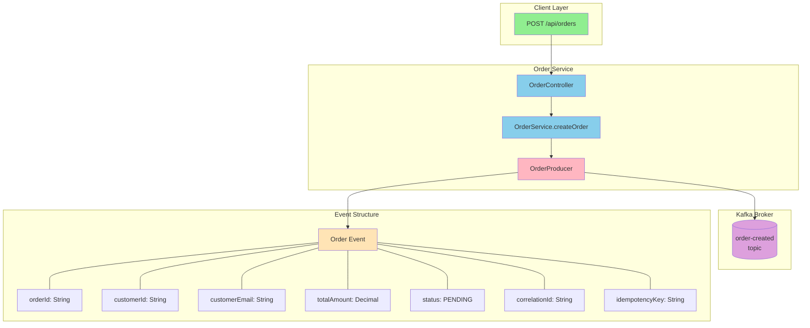

### 2.2 Order Consumer - Processing Order Created Events

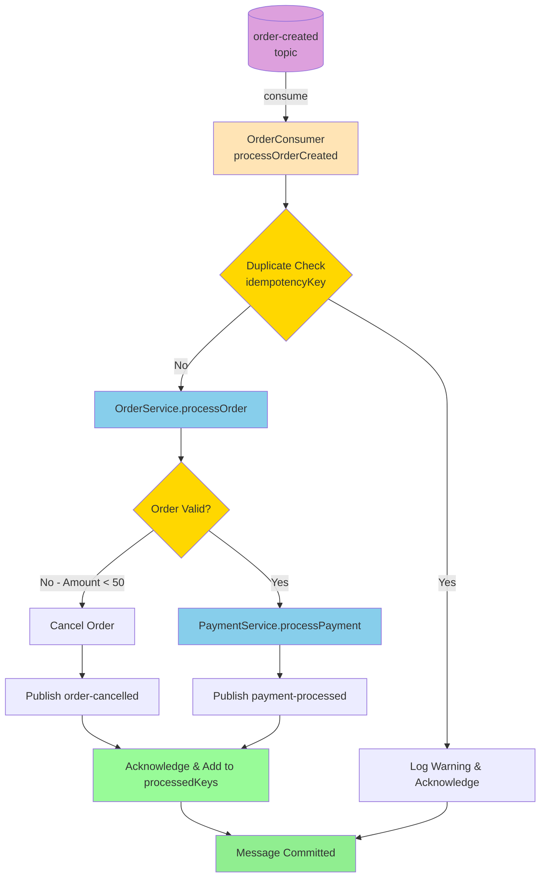

### 2.3 Order Consumer - Multiple Event Handlers

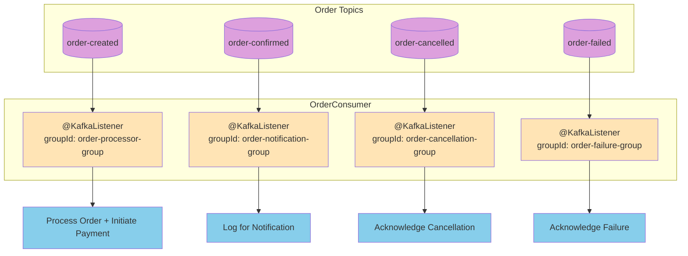

---

## 3. Payment Service Flow

### 3.1 Payment Processing Flow

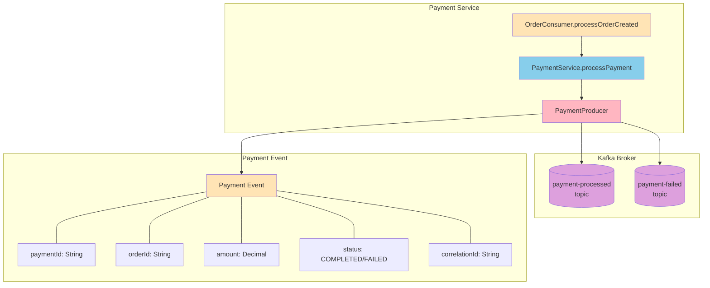

### 3.2 Payment Consumer - Payment Processed Flow

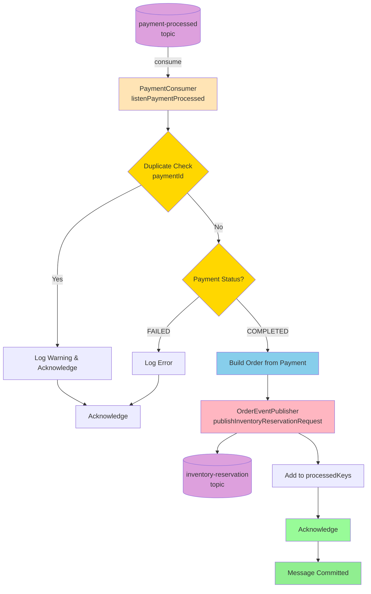

### 3.3 Payment Consumer - Payment Failed Flow with DLT

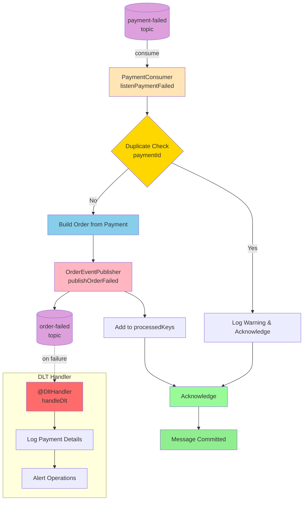

---

## 4. Inventory Service Flow

### 4.1 Inventory Reservation Request Flow

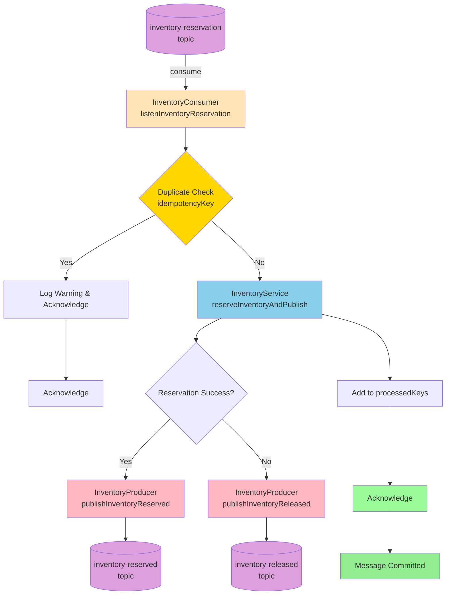

### 4.2 Inventory Reserved - Order Confirmation Flow

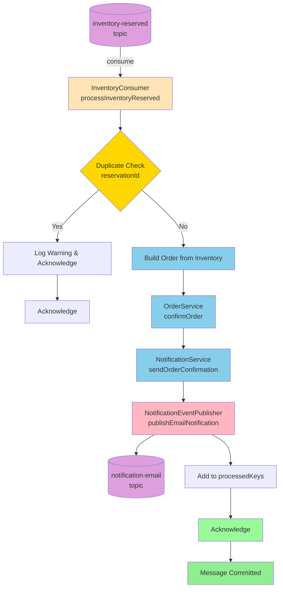

### 4.3 Inventory Released - Order Failure Flow

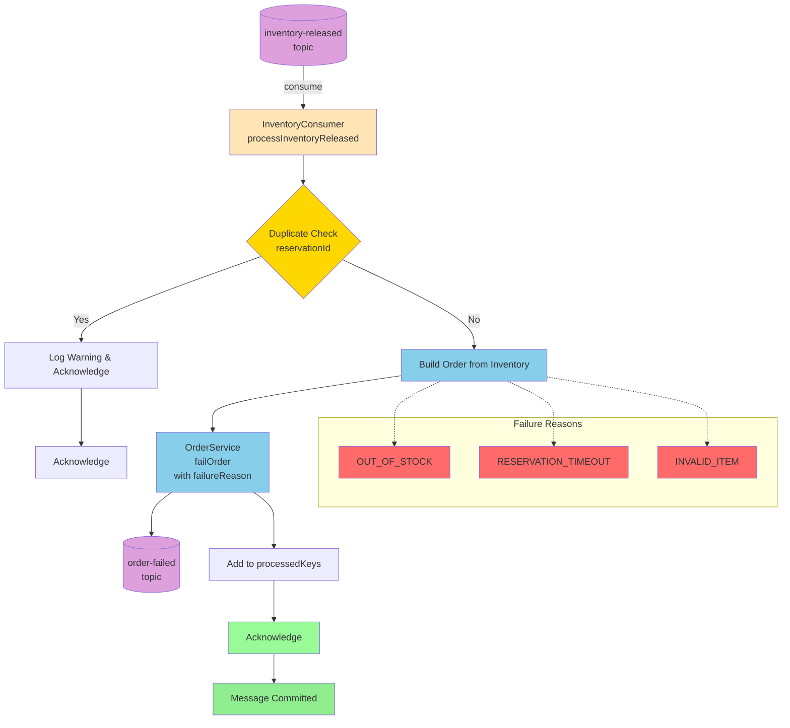

---

## 5. Notification Service Flow

### 5.1 Email Notification Flow

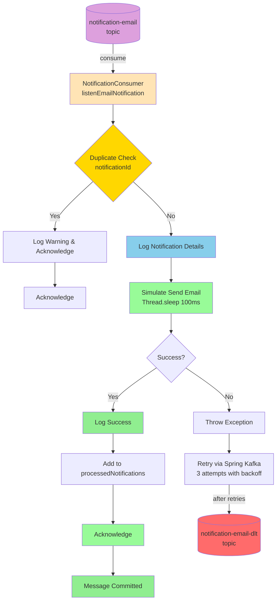

### 5.2 SMS Notification Flow

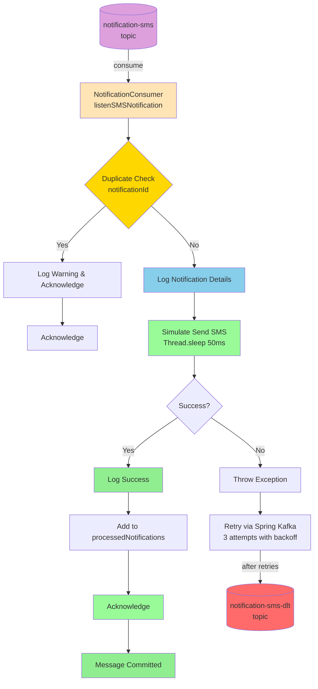

---

## 6. Complete End-to-End Flow

### 6.1 Happy Path - Standard Consumer Mode

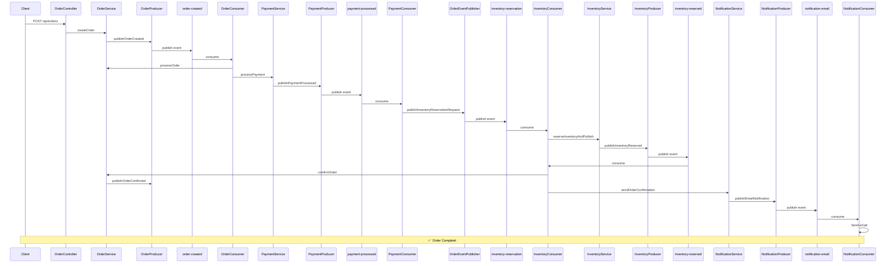

### 6.2 Component Architecture Overview

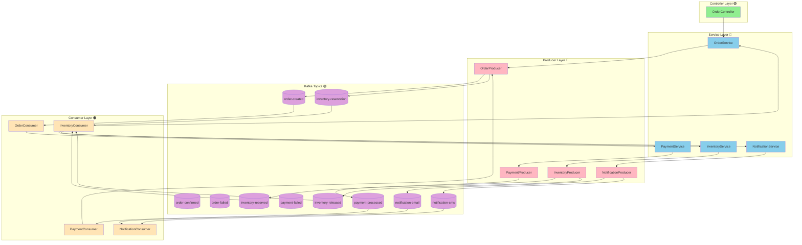

---

## 7. Saga Orchestrator Flow

### 7.1 Saga Pattern Overview

When `kafka.consumer.mode=saga`, the `OrderSagaOrchestrator` coordinates the entire transaction with compensation logic.

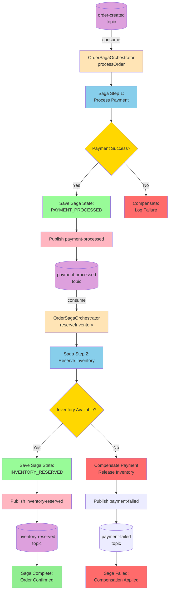

### 7.2 Saga Compensation Flow

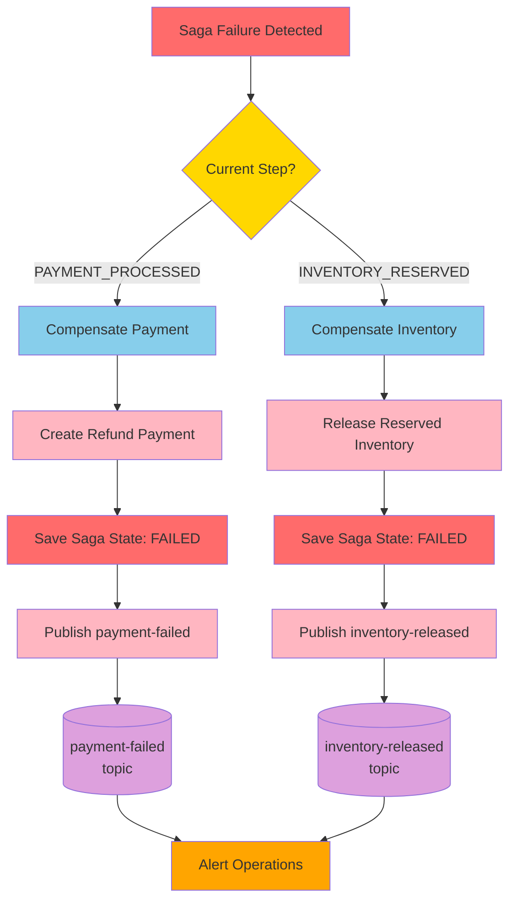

### 7.3 Saga Timeout Handling

```mermaid
flowchart TD
    A[@Scheduled<br/>checkSagaTimeouts<br/>every 60s] --> B[Query SagaStateRepository<br/>status=IN_PROGRESS<br/>updatedAt < 5min ago]

    B --> C{Timed Out Sagas?}
    C -->|No| D[Continue Monitoring]
    C -->|Yes| E[handleSagaTimeout]

    E --> F{Current Step?}

    F -->|PAYMENT_PROCESSED| G[Timeout: Payment done,<br/>inventory not reserved]
    G --> H[Compensate Payment]

    F -->|INVENTORY_RESERVED| I[Timeout: Inventory reserved,<br/>order not completed]
    I --> J[Compensate Inventory]

    H --> K[Update Saga State: FAILED]
    J --> K
    K --> L[Log Timeout Event]
    L --> M[Alert Operations]

    style A fill:#FFE4B5
    style B fill:#87CEEB
    style C fill:#FFD700
    style E fill:#87CEEB
    style F fill:#FFD700
    style G fill:#FFA500
    style H fill:#FFB6C1
    style I fill:#FFA500
    style J fill:#FFB6C1
    style K fill:#FF6B6B
    style L fill:#98FB98
    style M fill:#FFA500
```

---

## 8. Error Handling Flows

### 8.1 Retry Configuration

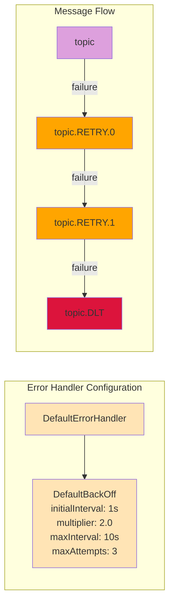

### 8.2 Dead Letter Topic Handling

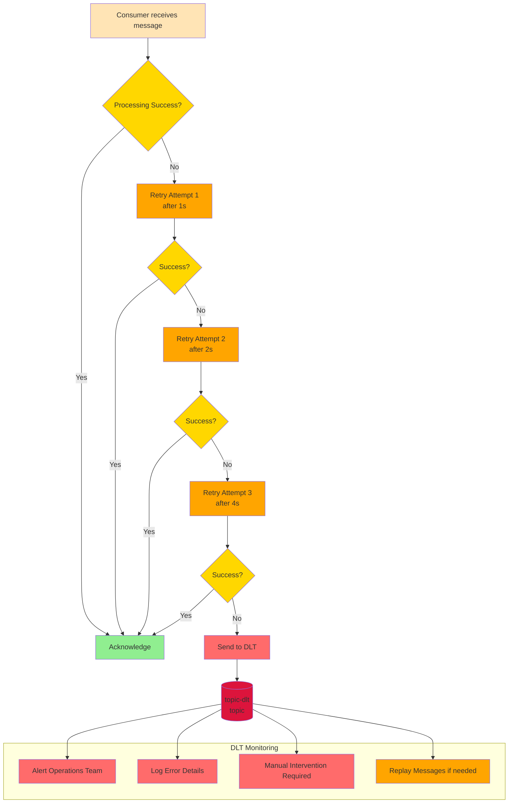

### 8.3 Idempotency Pattern

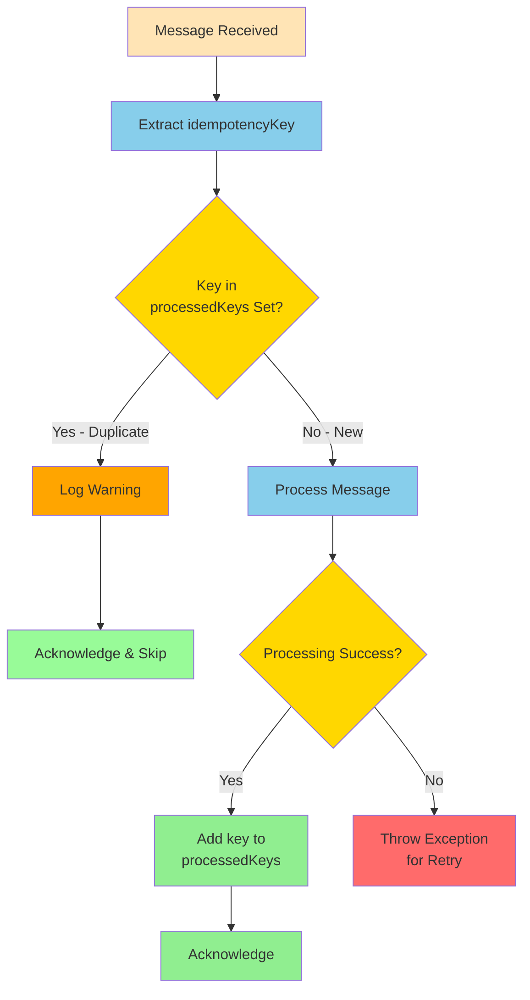

---

## 9. Topic Summary Table

| Topic | Partitions | Replicas | Producer | Consumer Group(s) |
|-------|-----------|----------|----------|-------------------|
| `order-created` | 3 | 1 | OrderProducer | order-processor-group, saga-orchestrator-group |
| `order-confirmed` | 3 | 1 | OrderProducer | order-notification-group |
| `order-cancelled` | 3 | 1 | OrderProducer | order-cancellation-group |
| `order-failed` | 3 | 1 | OrderProducer | order-failure-group, inventory-failure-group |
| `payment-processed` | 3 | 1 | PaymentProducer | payment-confirmation-group, saga-orchestrator-group |
| `payment-failed` | 3 | 1 | PaymentProducer | payment-failure-group |
| `inventory-reservation` | 3 | 1 | OrderEventPublisher | inventory-reservation-group |
| `inventory-reserved` | 3 | 1 | InventoryProducer | order-confirmation-group |
| `inventory-released` | 3 | 1 | InventoryProducer | inventory-failure-group |
| `notification-email` | 3 | 1 | NotificationProducer | notification-email-group |
| `notification-sms` | 3 | 1 | NotificationProducer | notification-sms-group |

**DLT Topics:**
- `order-created-dlt`
- `payment-processed-dlt`

---

## 10. Legend

| Color | Component Type |
|-------|---------------|
| 🟢 Green | Controller Layer (REST endpoints) |
| 🔵 Blue | Service Layer (Business logic) |
| 🔴 Red | Producer Layer (Event publishing) |
| 🟣 Purple | Kafka Topics |
| 🟠 Orange | Consumer Layer (Event handling) |
| 🟡 Yellow | Decision Points / Conditions |
| 🟢 Light Green | Success / Acknowledge |
| 🔴 Light Red | Error / Failure / DLT |
| 🟠 Orange | Retry / Warning |
