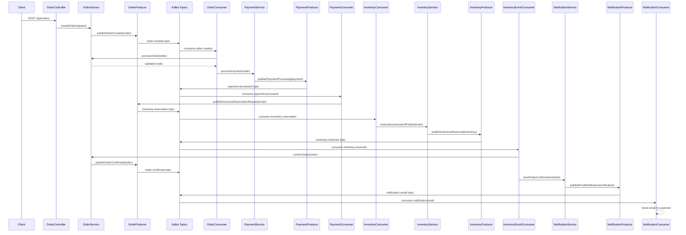
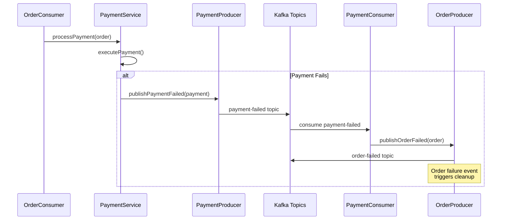
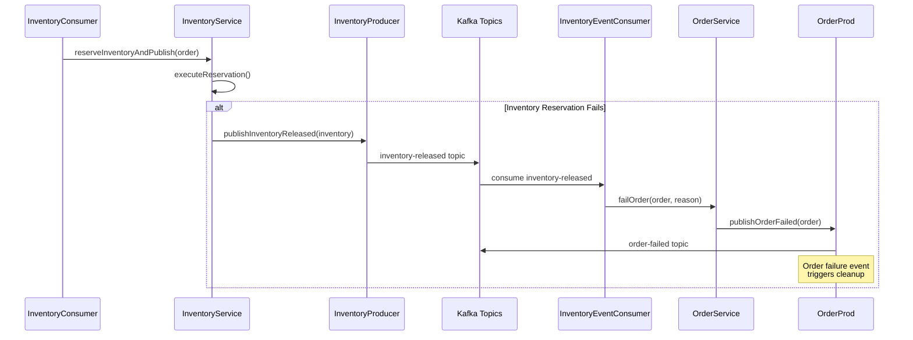
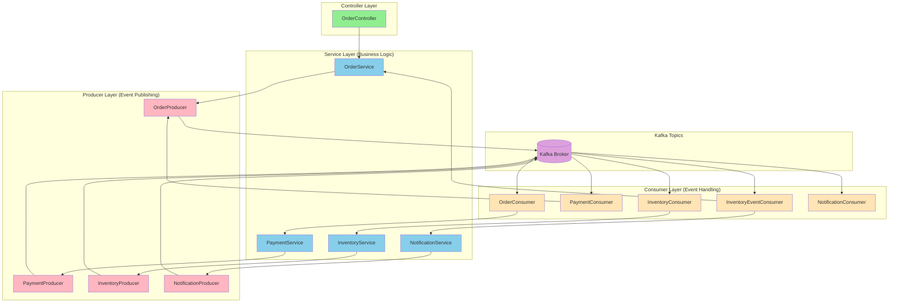

# Event Flow Diagram

## Complete Order Processing Flow

## Error Flow - Payment Failure

## Error Flow - Inventory Reservation Failure

## Component Architecture

## Legend
- 🟢 **Green**: Controller Layer (HTTP endpoints)
- 🔵 **Blue**: Service Layer (Business logic)
- 🔴 **Red**: Producer Layer (Event publishing)
- 🟣 **Purple**: Kafka Topics
- 🟠 **Orange**: Consumer Layer (Event handling)
